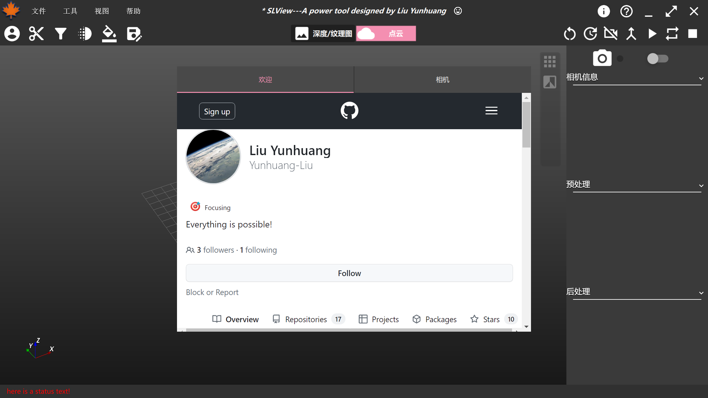
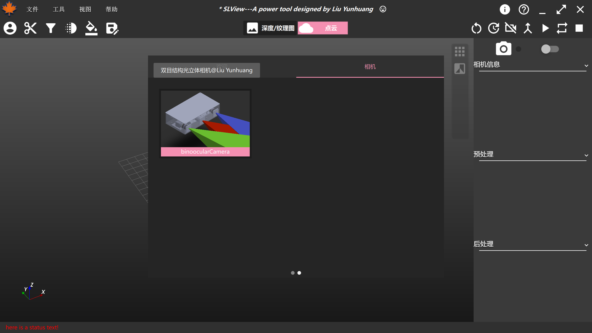
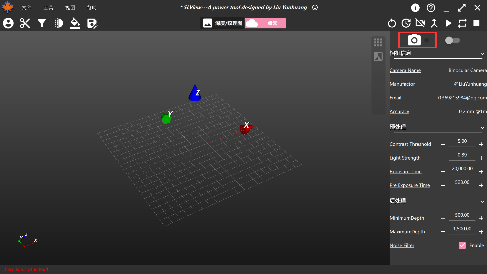
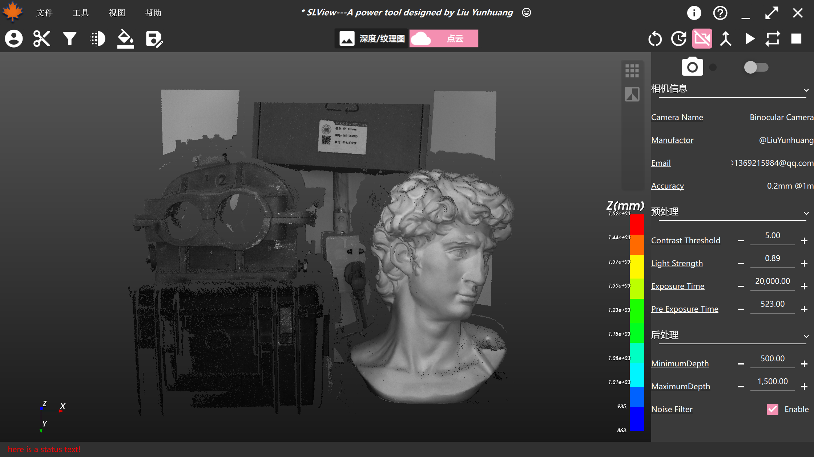
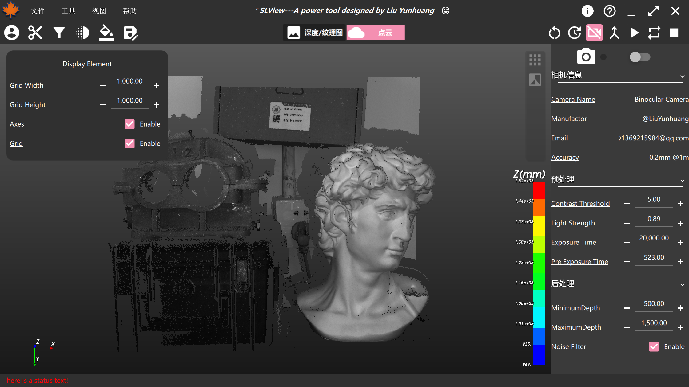
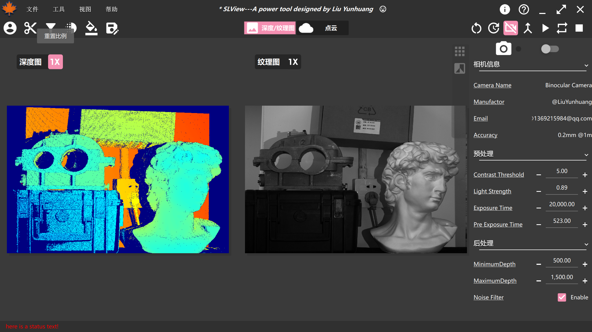
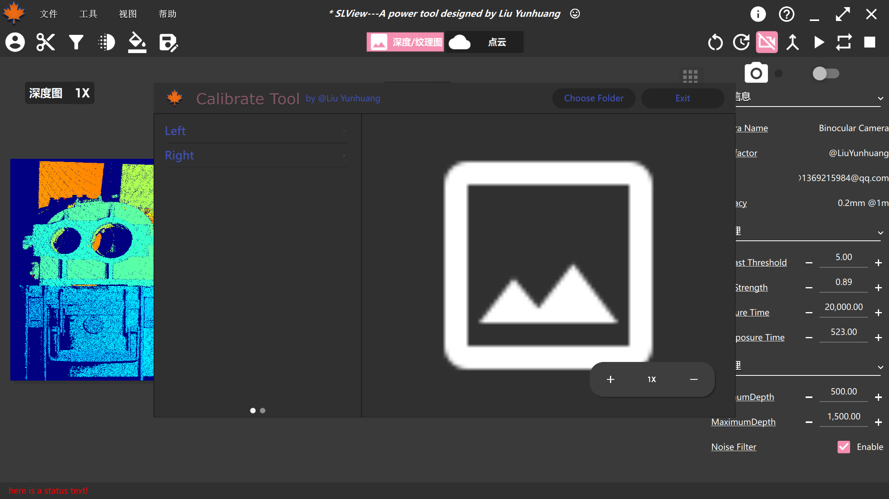
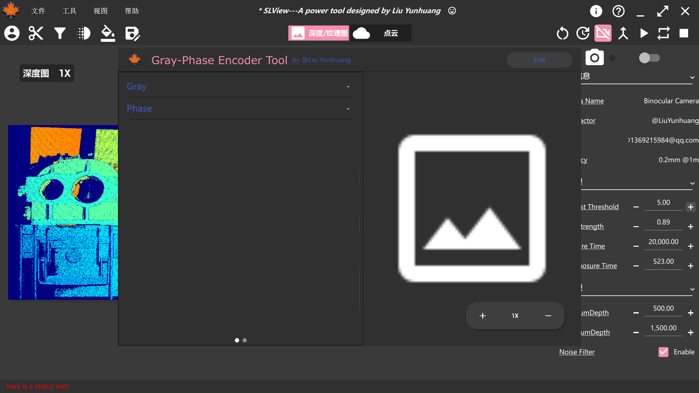

# 1.这是什么？
本库为结构光相机**GUI**，配有各类插件及点云插件，致力于完成一个显示、算法参数极易修改，同时易于插件扩展的软件。

如有任何相关使用，请引用：
```
@Author: LiuYunhuang
@SofeWare: SL-SDK
@Data: 2023.6.25
```
# 2.我则么获得它？
### 1. 依赖
首先，请检查您的计算机是否具备如下环境：
- `Qt (Pass with 5.12.10)`
- `SLCamera (See my repository)`
- `PCL (Pass with PCL1.12.1)`
- `VTK (Pass with VTK9.2)`
- `OpenCV (Pass with 4.5.2)`
- `Eigen3 (>3.4)`
- `Boost (>1.78)`
  
如有任何依赖项不满足，请查找相关资源进行配置。
### 2. 编译
本项目使用CMake进行项目构建。
# 3.我如何使用它
> 本软件拥有的部分功能如下所示：

|功能|界面|
|-|-|
|欢迎||
|相机选择||
|实时相机检测||
|离线重建模式||
|渲染元素选择||
|深度图、纹理图显示||
|标定工具插件||
|条纹生成器插件||

> 您可根据需要进行使用。
# 4. 待办事项
- [ ] 转台拼接
- [ ] 手眼标定
- [ ] 视点规划拼接